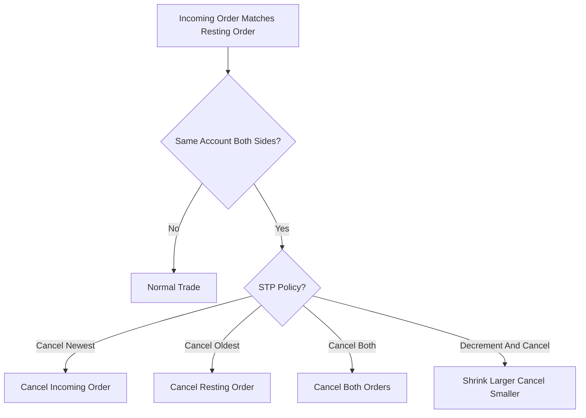

# Self-Trade Prevention (STP)

**What it is.** A guard that detects when one account's order would match against its own resting order (a wash trade) and resolves it by canceling the newest, oldest, both, or decrementing the larger and canceling the smaller.

**When to pick this.** Any venue with accounts running multiple strategies or market-making bots, where accidental self-matches create fake volume and regulatory wash-trading exposure.

**When NOT to pick this.** Never skip it on a real exchange — it is a safety policy layered on the matcher, not an optional matching style; only trivial single-user simulators can omit it.

**Real venue.** Coinbase, Kraken, and CME all expose configurable STP modes.

**Recommended crate.** `dashmap` — concurrent map from account id to live order ids for O(1) self-match lookup during matching without locking the whole book.
