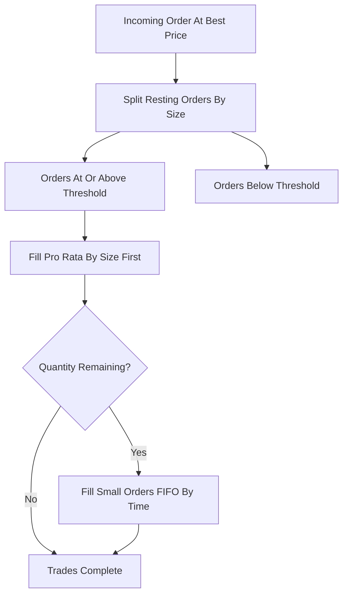

# Threshold Pro-Rata

**What it is.** Pro-rata matching (proportional-to-size fills) applies only to orders at or above a minimum size threshold, while smaller orders below it are filled in plain first-come-first-served (FIFO) order.

**When to pick this.** Pro-rata markets that want to discourage tiny token orders gaming the proportional split — only meaningfully sized orders earn a proportional cut.

**When NOT to pick this.** Books with mostly small orders (the threshold path rarely triggers), or venues wanting one uniform rule rather than two regimes.

**Real venue.** CME has used threshold (also "configurable") pro-rata on various futures contracts.

**Recommended crate.** `rust_decimal` — exact decimal split for the above-threshold pool `share_i = pool * (size_i / sum_big_sizes)`, with the FIFO tail needing no fractional math.
