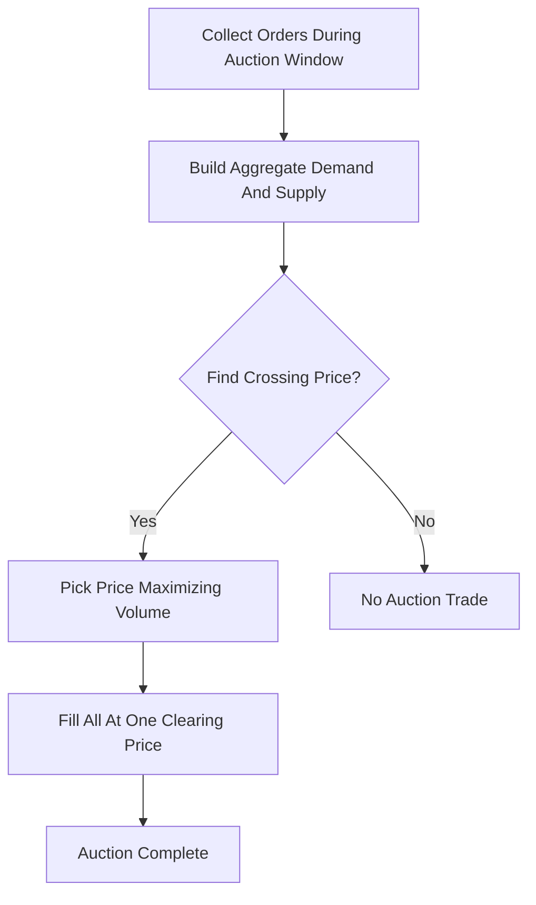

# Auction Matching (Uniform Price Auction)

**What it is.** Orders pile up over a window without trading, then the engine picks the single clearing price that maximizes matched volume and fills everyone at that one uniform price.

**When to pick this.** Market opens, closes, IPOs, and periodic call/batch auctions — batching trades neutralizes the microsecond speed race (the Frequent Batch Auction, FBA, idea) and concentrates liquidity at one fair price.

**When NOT to pick this.** When traders need immediate continuous execution; waiting for an auction window is unacceptable for active intraday trading.

**Real venue.** Nasdaq Opening/Closing Cross; the Walrasian-style clearing also underpins research venues running FBAs.

**Recommended crate.** `rust_decimal` — exact price arithmetic when scanning candidate prices to find the volume-maximizing clearing level without floating-point ambiguity.
