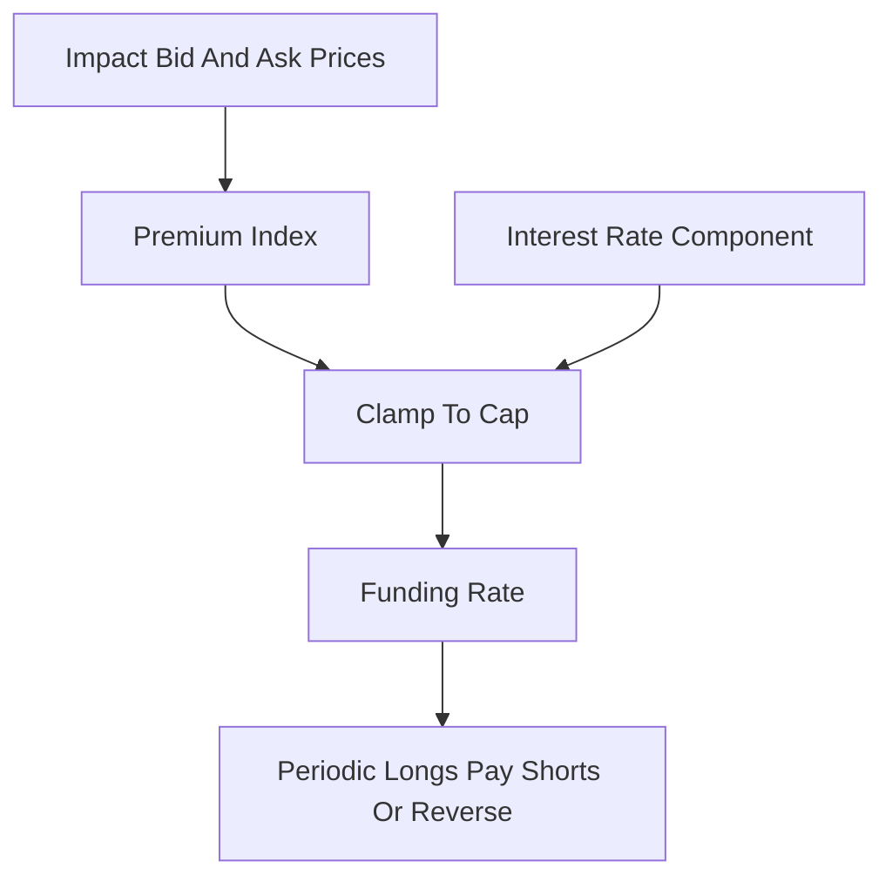

# Funding Rate

**What it is.** A small recurring payment between traders holding a perpetual future (a futures contract with no expiry date) that nudges its price back toward the real spot price of the asset.

**When to pick this.** You run a perpetual market and need the contract price to track the underlying asset without an expiry date to force convergence.

**When NOT to pick this.** You have a dated, expiring future (it settles to spot at expiry, so no funding is needed), or a pure spot venue with no leverage.

**Real venue.** Binance Futures, Bybit, dYdX, and Hyperliquid all charge funding; Binance/Bybit settle every 8h, dYdX and Hyperliquid every 1h.

**Recommended crate.** rust_decimal — funding is money math where floating-point rounding is unacceptable.

The formula is `Funding = Premium + clamp(Interest − Premium, −c, +c)`, where the **Premium** is how far the contract trades above spot (measured from impact bid/ask vs the index price), **Interest** is a fixed baseline (Binance uses ~0.01% per 8h), and `clamp` caps the adjustment at `±c`. Positive funding means longs (buyers) pay shorts (sellers), pulling the price down toward spot; negative reverses it. Hyperliquid clamps funding tightly and pays hourly to limit one-sided pressure.
