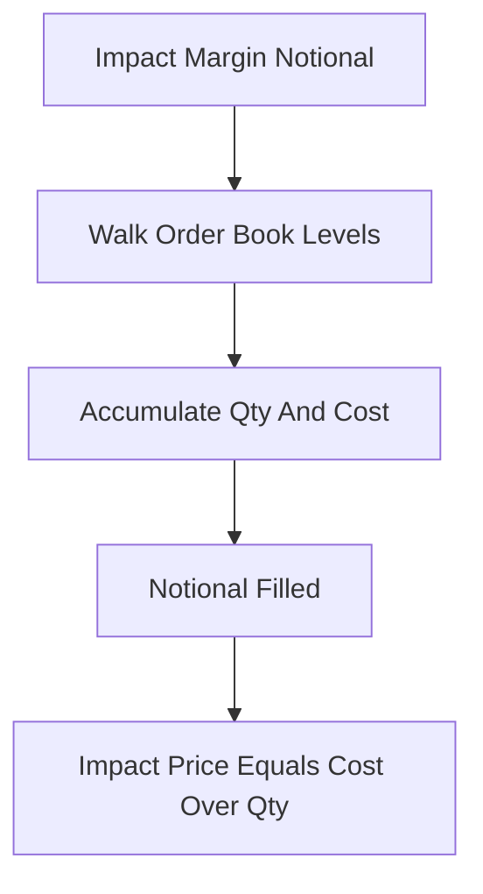

# Impact Bid/Ask Price

**What it is.** The average price you would actually get if you bought (or sold) a fixed dollar amount by eating through the order book level by level.

**When to pick this.** You need a price that reflects real, executable liquidity — for example to build a manipulation-resistant premium for funding, where the top-of-book quote alone is too easy to fake.

**When NOT to pick this.** You only need the best quote or last trade, or the book is too thin/illiquid for a meaningful fill estimate.

**Real venue.** Binance and Bybit compute Impact Bid/Ask over an "Impact Margin Notional" to feed the funding premium index.

**Recommended crate.** slab — walking many price levels per tick wants a dense, cache-friendly arena for order-book nodes.

You fix a target size called the **Impact Margin Notional** (a dollar amount, e.g. the notional a small fixed margin could buy). Then you "walk the book": consume the best price level, then the next, accumulating filled quantity and total cost until you have filled that notional. The result is `Impact Price = total cost / total quantity` — the volume-weighted average fill price. Because it averages across many levels, a single tiny order placed at the top cannot move it, unlike the raw best bid/ask. This needs an **iterable** order book (you must traverse levels in price order), which is why a compact arena like slab over a sorted structure matters for latency.
