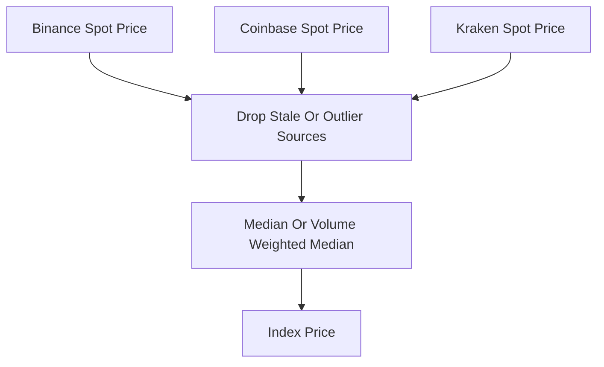

# Index Price Aggregation

**What it is.** A single "fair" spot price built by combining the live prices from several independent exchanges so no one venue can manipulate it.

**When to pick this.** You need a manipulation-resistant reference price to drive funding, mark price, and liquidations on a perpetual or derivatives market.

**When NOT to pick this.** The asset trades on only one venue (no diversity to aggregate), or you can trust a single regulated price feed directly.

**Real venue.** Binance, Bybit, dYdX, and Hyperliquid all publish an index built from multiple spot exchanges; Hyperliquid weights sources and drops outliers on-chain.

**Recommended crate.** rust_decimal — combining prices from many feeds without float drift keeps the index reproducible.

The simplest form is the **median** of the source prices: sort them and take the middle value, so a single bad feed cannot move the result. A refinement is the **volume-weighted median**, where each price counts in proportion to that exchange's trading volume (busier markets count more). Some venues also apply a short **TWAP** (time-weighted average price — the average over a recent window, e.g. 30s) to smooth flicker. Before aggregating, sources that are stale, far from the pack, or have collapsed liquidity are dropped. Binance and Bybit publish a fixed basket of spot exchanges with periodic review; dYdX uses oracle-reported medians.
