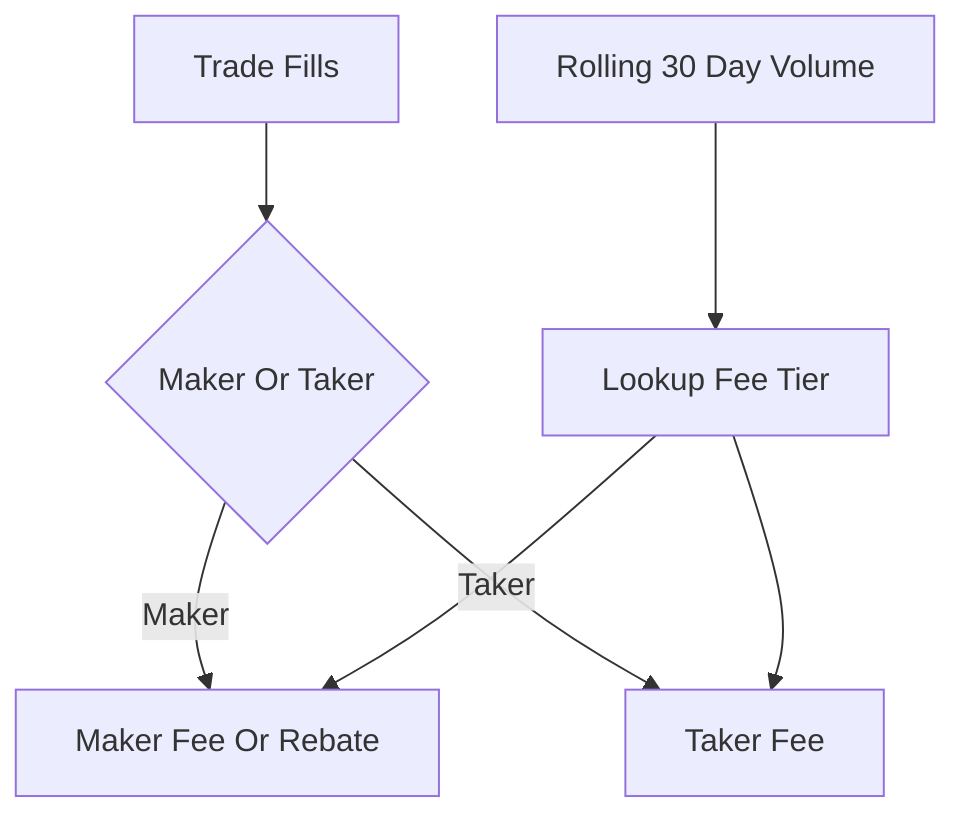

# Maker/Taker Fee Tiers

**What it is.** A fee schedule where you pay less the more you trade, and where adding liquidity (a "maker" order) is cheaper than removing it (a "taker" order).

**When to pick this.** You want to reward order-book depth and high-volume traders — makers post resting orders that fill the book, takers consume them.

**When NOT to pick this.** A flat single fee is simpler and fine for a tiny venue, or a pure auction model where the maker/taker distinction does not exist.

**Real venue.** Binance, Bybit, dYdX, and Hyperliquid all use 30-day-volume tiers; Binance and dYdX even pay negative maker fees (rebates) at the top tiers.

**Recommended crate.** dashmap — fee lookups by account run on every fill and must be concurrent and lock-light on the hot path.

A **maker** is an order that rests on the book and waits (adding liquidity); a **taker** crosses the spread and fills immediately (removing it). The fee is `fee = notional × rate(tier, role)`, where `notional` is trade size in quote currency, `tier` comes from your trailing 30-day volume, and `role` is maker or taker. Higher tiers (more volume) get lower rates; at the top, the maker rate can go **negative** — a rebate, meaning the venue pays you to provide liquidity. Takers always pay the higher rate because they consume depth others provided.
