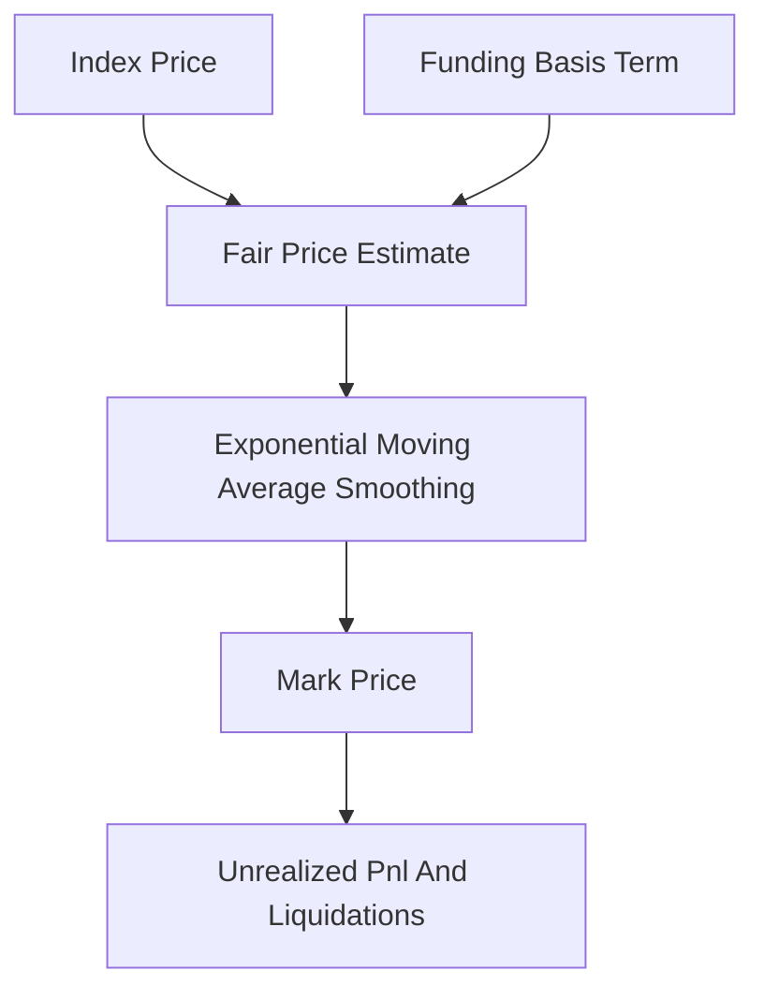

# Mark Price

**What it is.** A smoothed "fair value" price used to calculate your profit/loss and to decide liquidations, so a brief price spike on the order book cannot wrongly wipe out your position.

**When to pick this.** You run a leveraged market and must value open positions and trigger liquidations using a price that ignores momentary order-book noise and wicks.

**When NOT to pick this.** Spot trading with no leverage and no liquidations — the last traded price is enough there.

**Real venue.** Binance, Bybit, dYdX, and Hyperliquid all liquidate on a mark price, not the last trade, to stop "wick hunting" liquidations.

**Recommended crate.** rust_decimal — PnL and liquidation thresholds are money math that must round deterministically.

One common formula is `Mark = Index + clamp(Basis, −c, +c)`, where **Basis** is the perpetual's funding-implied premium over the index (how much the contract trades above or below spot), clamped so it stays bounded. An alternative, used by Binance, is an **EMA** (exponential moving average — a running average that weights recent values more) of the median of three fair-price candidates. The point is the same: liquidations and unrealized PnL key off this stable number rather than the volatile last trade, so a one-tick spike on a thin book cannot trigger a cascade of liquidations.
