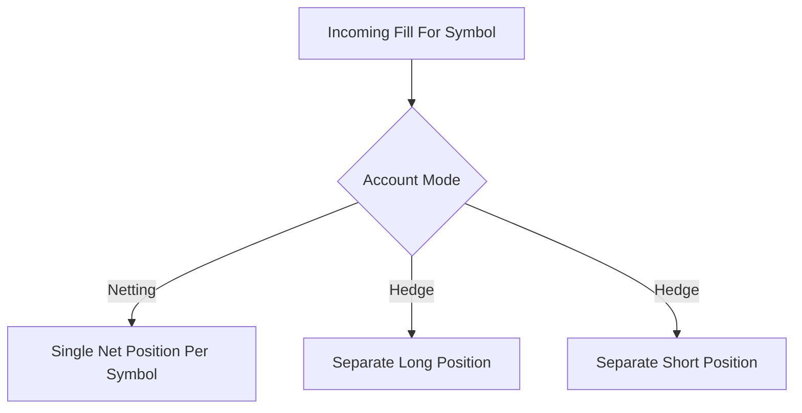

# Position Netting vs Hedge Mode

**What it is.** Two ways an account can hold positions in one market: **netting** keeps a single combined position per symbol, while **hedge mode** lets you hold a long and a short in the same symbol at the same time.

**When to pick this.** Pick hedge mode when traders want independent long and short legs (e.g. running two strategies on BTC); pick netting for simpler accounting and lower margin.

**When NOT to pick this.** Avoid hedge mode if you want minimal complexity — two opposing positions usually just cancel economically while costing double the bookkeeping and margin.

**Real venue.** Binance and Bybit offer both One-Way (netting) and Hedge modes; dYdX and Hyperliquid use netting only (one net position per market).

**Recommended crate.** dashmap — a concurrent map keyed by (account, symbol) lets many fills update positions in parallel without a global lock.

Under **netting**, a buy of size `q` adds to one signed position: `new = old + q` (a sell uses `−q`); the sign tells you long or short. A buy that exceeds an existing short flips the single position through zero. Under **hedge mode** the engine keeps two separate buckets, `long` and `short`, and routes each fill to the matching leg by an explicit position-side flag on the order; closing one leg never touches the other. Hedge mode roughly doubles position rows and margin tracking, so most on-chain venues skip it for simplicity.
