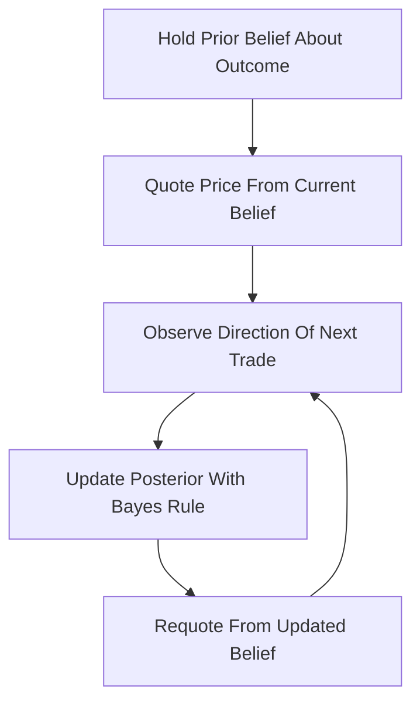

# Bayesian Market Maker

**What it is.** A market maker that treats every trade as evidence and updates its own probability estimate of the outcome using Bayes' rule, then quotes prices straight from that updated belief.

**When to pick this.** You think some traders know more than you (informed flow) and you want prices to chase that private information quickly, while protecting the maker from being systematically picked off.

**When NOT to pick this.** You cannot specify a believable model of how informed-versus-noise trades arrive, or you need the simple, provable loss bound that LMSR gives — Bayesian makers are model-dependent and harder to reason about.

**Real venue.** No production user known (this is the academic Glosten-Milgrom lineage; most live venues ship LMSR/CFMM instead).

**Recommended crate.** n/a (off-chain/math).

The maker keeps a posterior probability `P(outcome)` and, on seeing a buy, updates it with Bayes' rule:

`P(yes | buy) = P(buy | yes) * P(yes) / P(buy)`

Here `P(buy | yes)` is how likely an informed trader is to buy when the true answer is yes. The quoted price is simply the current posterior (plus a spread to cover noise). A buy nudges the belief up, a sell nudges it down; the more a trade "should not" happen under the current belief, the bigger the update. Over many trades the price converges toward what the best-informed participants collectively know — the classic information-aggregation result behind sequential trade models.
