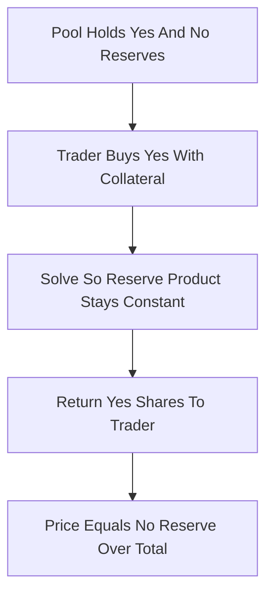

# CFMM for Binary Outcomes

**What it is.** A constant-product automated market maker (the Uniswap "x times y equals k" idea) applied to a pool of YES and NO outcome shares, so a smart contract prices bets with no order book and no human operator.

**When to pick this.** You want a fully on-chain, permissionless market where anyone can add liquidity and the pricing is one tiny formula, and you accept that liquidity providers take on directional risk if the market resolves against the pool.

**When NOT to pick this.** You need tight spreads near certainty (CPMM slippage explodes as a price approaches 0 or 1), or you want the bounded-loss guarantee of LMSR — a thin CPMM pool can be drained by an informed trader.

**Real venue.** Augur v2 and the Gnosis/Omen prediction markets used CPMM pools over conditional outcome shares.

**Recommended crate.** rust_decimal (deterministic on-chain-style reserve math; no floats).

The pool holds reserves `x` of YES shares and `y` of NO shares and enforces:

`x * y = k`

To buy `dy` worth of one side you add collateral so the product `k` is preserved, and the price of YES is its scarcity relative to the pool: `price_yes = y / (x + y)`. Buying YES drains `x`, raising its price toward 1; the two prices always sum to 1 because every unit of collateral mints one YES plus one NO. The constant-product curve means large trades pay increasing slippage, which is the maker's protection and the liquidity provider's fee source.
