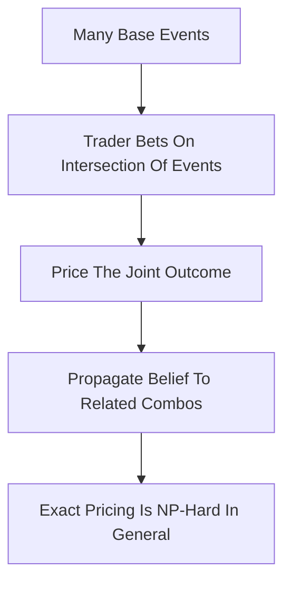

# Combinatorial Prediction Markets

**What it is.** A market where you bet not just on single events but on combinations of them — "A wins AND B loses AND it rains" — so a single price captures a joint probability across many linked questions.

**When to pick this.** You want trades on one question to automatically and consistently move the prices of related questions (true information aggregation across a whole space of outcomes), as in a logically connected set of events.

**When NOT to pick this.** You need fast, guaranteed-correct prices — computing exact combinatorial prices is NP-hard in general (the maker must reason over `2^n` joint outcomes), so production systems must approximate and accept some arbitrage.

**Real venue.** Microsoft Research / Yahoo! experimental combinatorial markets (Pennock, Chen et al.); no broad production user known.

**Recommended crate.** n/a (off-chain/math).

The state space is every combination of `n` base events, so up to `2^n` joint outcomes. A natural pricing engine extends LMSR over that space:

`C(q) = b * ln( sum over all joint outcomes of exp(q_j / b) )`

A bet on "A and B" is a bet on the subset of joint outcomes where both hold; pricing it requires summing `exp` over that subset, which is the hard part. Exact summation is intractable past a handful of events, so real systems restrict the structure (independence assumptions, tree/graph constraints) or use sampling and Monte-Carlo approximation, trading a small, bounded arbitrage for tractable speed.
