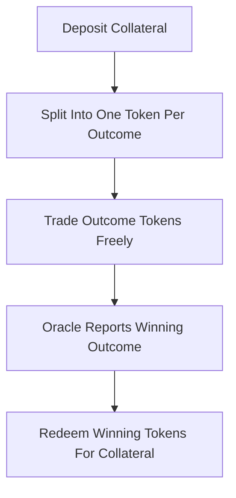

# Conditional Tokens Framework (CTF)

**What it is.** A smart-contract standard from Gnosis that turns one unit of collateral into a full set of outcome tokens you can split, combine, and trade — including tokens for combinations of several events at once (combinatorial outcomes).

**When to pick this.** You want a reusable on-chain plumbing layer that any market maker (CPMM, order book, etc.) can sit on top of, and you need to express bets on combinations like "candidate A wins AND rates rise."

**When NOT to pick this.** Your market is a single simple yes/no question off-chain — CTF's split/merge machinery and gas cost are overkill, and deep nesting of conditions gets expensive fast.

**Real venue.** Polymarket settles on Gnosis Conditional Tokens; Gnosis/Omen also use CTF.

**Recommended crate.** rkyv (compact, zero-copy serialization of the position-id/outcome-set state these contracts track).

CTF is bookkeeping, not pricing. Depositing 1 collateral lets you `split` it into one token per outcome of a condition; holding the complete set lets you `merge` back to 1 collateral. Each position is keyed by a `collectionId` derived from hashing the condition and the chosen outcome subset, so positions over multiple conditions compose into a single token id:

`positionId = hash(collateral, collectionId)`

After an oracle reports, each winning token redeems for its share of the collateral and losing tokens are worth zero. Because any complete set always merges back to exactly 1 unit, the system is fully collateralized and self-balancing — the maker layer on top only sets prices, never holds the payout risk.
