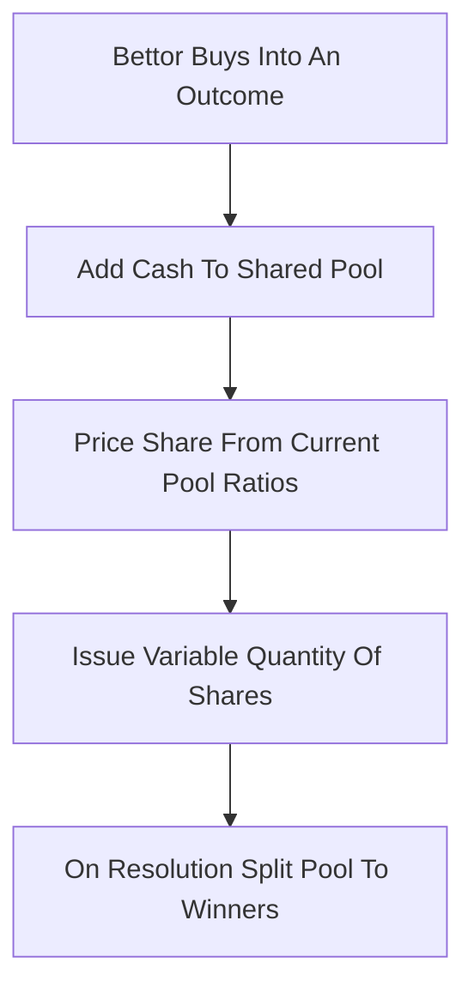

# Dynamic Pari-Mutuel Market (DPM)

**What it is.** A market design by David Pennock that runs a betting pool like horse-racing's pari-mutuel (winners split the total pot) but lets you trade continuously before the event resolves, with prices that move as money flows in.

**When to pick this.** You want the operator to carry zero risk (the pool only ever pays out money already collected) while still giving traders live, moving prices they can buy and sell into before the result is known.

**When NOT to pick this.** You need a guaranteed payout-per-share fixed at purchase time — DPM payouts depend on the final pool, so what a share is worth at settlement can drift from its purchase price.

**Real venue.** Yahoo! built DPM into its Tech Buzz Game prediction market (with Pennock at Yahoo! Research).

**Recommended crate.** rust_decimal (pool balances and payout ratios must be exact).

Money paid in goes into one pool `T`; each outcome `i` holds a share count `q_i`. The instantaneous price of an outcome's share is its pool fraction:

`price_i = M_i / T`

where `M_i` is money wagered on outcome `i`. The "dynamic" part: because price rises as people pile into an outcome, a fixed amount of cash buys fewer shares as that side gets crowded, so early backers of the eventual winner are rewarded. At resolution the entire pool `T` is divided among holders of the winning outcome in proportion to their shares — no external subsidy, so the house cannot lose.
