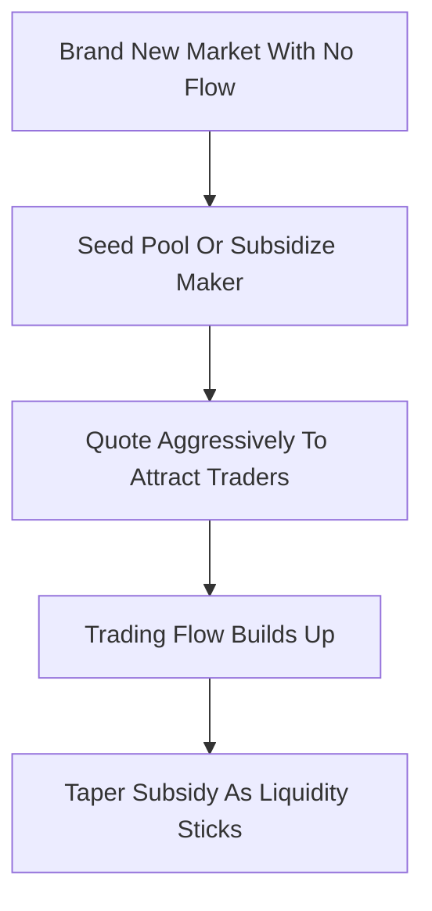

# Liquidity Bootstrapping / Maniac MM

**What it is.** A family of cold-start techniques that get a brand-new market tradable by seeding it with subsidized liquidity or extra-aggressive quoting until real two-sided flow shows up.

**When to pick this.** You are launching fresh markets constantly (so each starts empty) and need them to look liquid and quote tight spreads on day one to attract the first traders.

**When NOT to pick this.** You have an established venue with persistent flow — paying a bootstrap subsidy on an already-liquid market just burns money for no extra depth.

**Real venue.** Balancer's Liquidity Bootstrapping Pools popularized the on-chain pattern; prediction venues like Polymarket subsidize new-market liquidity with maker-reward programs.

**Recommended crate.** parking_lot (fast mutexes guarding the per-market subsidy budget and quote state).

There is no single fixed formula — bootstrapping wraps a base maker (LMSR or CFMM) and varies its parameters over time. A common shape ties the liquidity parameter to elapsed subsidy and observed volume:

`b(t) = b_seed + alpha * cumulative_volume(t)`

Early on `b` is funded by a seed grant so spreads are tight despite no organic flow; as `cumulative_volume` grows, the market becomes self-sustaining and the operator tapers `b_seed` to zero. The "maniac" variant simply quotes very tight, loss-leading spreads at launch — deliberately accepting early losses to buy the price discovery and trader attention that make the market viable.
