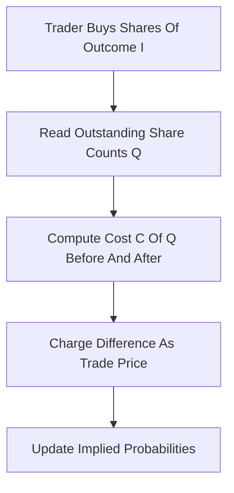

# LMSR (Logarithmic Market Scoring Rule)

**What it is.** A formula-driven market maker (an automated counterparty) invented by Robin Hanson that always quotes a price for every outcome of an event, so you never need a matching buyer or seller.

**When to pick this.** You want a market that is always tradable, even with zero other participants, and you can accept a fixed, known maximum loss as the cost of providing that liquidity.

**When NOT to pick this.** You need the market to break even on its own, or you have deep two-sided order flow that an order book would match for free without subsidy.

**Real venue.** Used by PredictIt and historically by Microsoft's internal prediction markets and Inkling/Consensus Point platforms.

**Recommended crate.** rust_decimal (exact money math; pair with a libm `exp`/`ln` for the curve).

The maker tracks how many shares `q_i` exist of each outcome and prices everything off one cost function:

`C(q) = b * ln( sum_i exp(q_i / b) )`

A trade that moves the share vector from `q` to `q'` costs `C(q') - C(q)`. The implied probability of outcome `i` is `p_i = exp(q_i / b) / sum_j exp(q_j / b)`, and these always sum to 1. The liquidity parameter `b` is the only knob: larger `b` means prices move slowly (deep liquidity) but the operator's worst-case subsidy is `b * ln(N)` for `N` outcomes. Small `b` means thin, jumpy prices but cheap to run.
