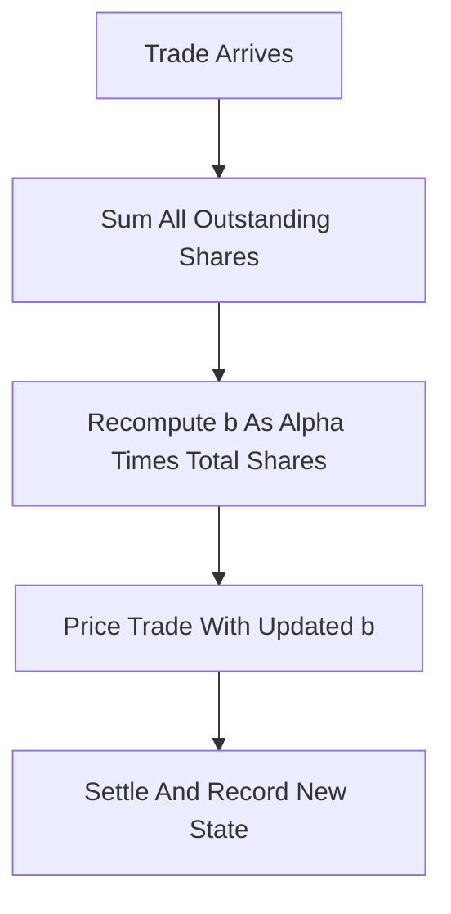

# LS-LMSR (Liquidity-Sensitive LMSR)

**What it is.** A variant of LMSR by Abraham Othman and Tuomas Sandholm where the liquidity knob `b` grows automatically as trading volume grows, so the market is thin (cheap to seed) when new and deep when busy.

**When to pick this.** You want LMSR's always-on quoting but dislike picking a fixed `b` up front, and you would rather the market fund its own liquidity from trading fees as it scales.

**When NOT to pick this.** You need the operator's worst-case loss to be a fixed, bounded number, or you need prices to provably sum to exactly 1 (LS-LMSR prices sum to slightly more than 1, the difference being the maker's fee).

**Real venue.** Gnosis built LS-LMSR into early Gnosis/Olympia prediction-market contracts; described in Othman & Sandholm (2010).

**Recommended crate.** rust_decimal (exact share/fee accounting alongside the `exp`/`ln` curve).

Instead of a constant `b`, set it proportional to the total shares outstanding:

`b(q) = alpha * sum_i q_i`

The cost function keeps the LMSR shape, `C(q) = b(q) * ln( sum_i exp(q_i / b(q)) )`, but now `b` rises as the pool fills. The tunable `alpha` controls how much the maker charges: prices across all outcomes sum to `1 + alpha * N * ln(N)` rather than 1, and that overround is the maker's revenue. Early trades face a small `b` (prices move a lot, attracting price-setters), while a mature market has a large `b` (stable prices for size).
