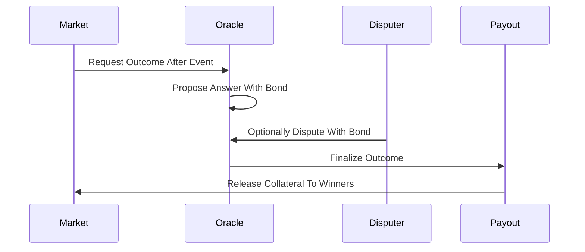

# Oracle Resolution

**What it is.** The settlement step where a trusted source — an optimistic oracle, a price feed, or a human committee — declares the real-world answer so winning shares can be paid out.

**When to pick this.** Your market resolves on a real-world fact that no contract can observe on its own (an election, a sports score, a court ruling), so you need an external, disputable authority to report the truth.

**When NOT to pick this.** The outcome is already fully on-chain and verifiable (e.g., "did this block hash end in zero") — then read it directly and skip the oracle's trust assumptions, latency, and dispute window.

**Real venue.** Polymarket uses UMA's Optimistic Oracle; other venues use Chainlink price feeds or multisig committees for resolution.

**Recommended crate.** tracing (audit-grade logging of every proposal, dispute, and finalization for after-the-fact review).

There is no pricing formula here — resolution sets the final payout, not a price. The dominant pattern is optimistic: a proposer posts an answer backed by a bond, and it is accepted as true unless someone disputes within a window by posting an equal bond. A dispute escalates to a vote or a higher authority; the loser forfeits their bond:

`payout_share = 1 if outcome == winning else 0`

The bond-and-dispute economics make honesty the cheapest strategy — lying costs your bond — so most reports finalize uncontested and cheaply, while genuinely contested cases get escalated. Chainlink-style feeds and multisig committees are simpler alternatives that trade decentralization for speed.
