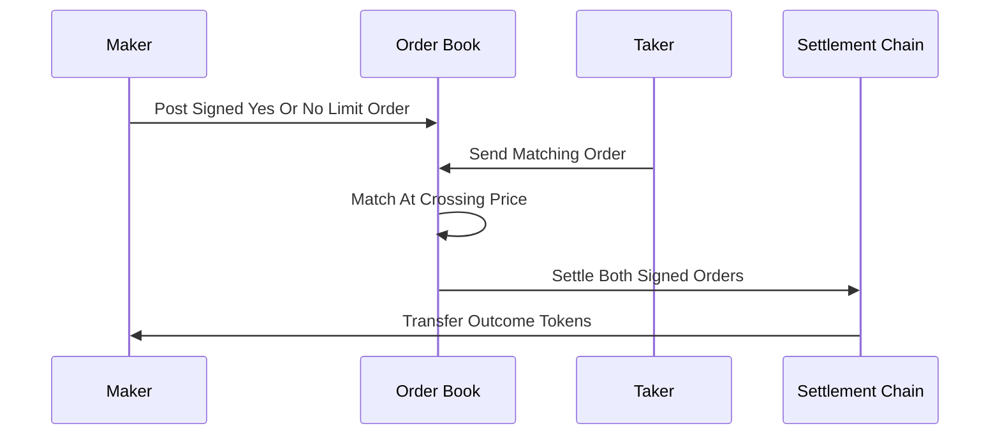

# Polymarket-Style CLOB

**What it is.** A central limit order book (a classic exchange where buy and sell limit orders queue and match by price) operating over YES/NO outcome tokens that each redeem for exactly 1 unit of collateral if their side wins.

**When to pick this.** You have enough two-sided flow that real market makers will quote tight spreads, and you want true price-time-priority matching plus the capital efficiency of an order book rather than a subsidized formula maker.

**When NOT to pick this.** Your market is brand-new or thin — an empty book quotes nothing, so a cold-start venue is better served by a formula maker (LMSR/CFMM) until liquidity arrives.

**Real venue.** Polymarket runs a hybrid CLOB (off-chain matching, on-chain settlement) over Gnosis conditional tokens.

**Recommended crate.** crossbeam (lock-free queues for the order-ingest and matching hot path).

Pricing is just supply and demand on the book: there is no cost formula. Because one YES plus one NO redeems for 1 unit of collateral, prices are pinned by the no-arbitrage identity:

`price_yes + price_no = 1`

A YES order at 0.62 means the buyer pays 0.62 to receive 1 on a YES resolution (an implied 62% probability). The book matches a taker against resting maker orders at the best crossing price; trades are signed off-chain for speed and settled on-chain against the conditional-token contracts. This is the same order-book discipline as the matching-engine catalog — see XO Markets entries CLA-103 and CLA-104 for the price-time-priority matching core that a venue like this reuses.
