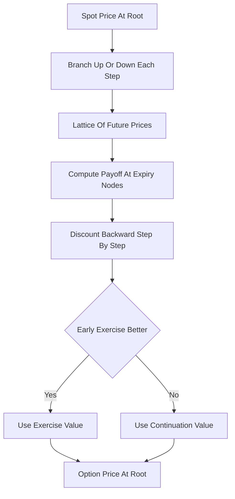

# Binomial / Trinomial Trees

**What it is.** A tree (lattice) model prices an option by building a branching grid of possible future prices, then working backward from expiry, at each node checking whether exercising early beats holding.

At every time step the price moves up or down (binomial) or up/flat/down (trinomial). You fill in the payoff at the final nodes, then roll backward discounting expected value: `value = e^(−rΔt)·(p·up + (1−p)·down)`. The key trick: at each node for an American option you compare that continuation value against the immediate exercise value and keep the larger — capturing the right to exercise early, which Black-Scholes cannot.

Why a venue uses it: American options (most listed equity options) can be exercised any day, and lattices price that early-exercise right correctly while staying simple and convergent.

**When to pick this.** American or Bermudan options with early exercise, or simple path-dependence, where you need an auditable, convergent price.

**When NOT to pick this.** Plain European options (use Black-Scholes — instant) or high-dimensional/exotic payoffs (trees explode; use Monte Carlo).

**Real venue.** OCC-cleared US equity options; broker risk engines.

**Recommended crate.** `n/a (off-chain/math)`.
