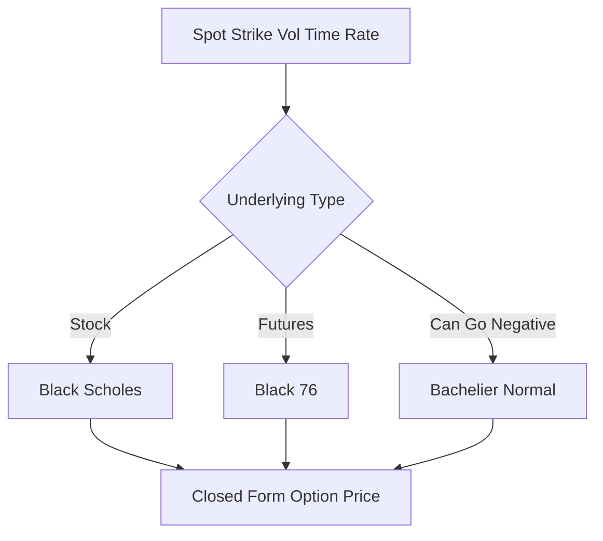

# Black-Scholes / Black-76 / Bachelier

**What it is.** Black-Scholes and its cousins are closed-form formulas that give the fair price of a European option (one exercisable only at expiry) directly from a handful of inputs — no simulation needed.

The classic Black-Scholes prices stock options as `C = S·N(d₁) − K·e^(−rT)·N(d₂)`, where S is spot, K the strike, T time to expiry, r the rate, and N the normal distribution. **Black-76** is the same machinery adapted to futures (uses the forward price). **Bachelier** assumes prices move in dollar terms (normally) rather than percentages, so it can handle negative prices — the model exchanges reached for after oil futures went negative in 2020.

Why a venue uses it: it is instant and exact, so quotes, margin, and Greeks can be recomputed millions of times per second on a live book.

**When to pick this.** European options on a single underlying where you need fast, analytic prices and Greeks.

**When NOT to pick this.** American options with early exercise, path-dependent or exotic payoffs — the closed form does not apply; use trees or Monte Carlo.

**Real venue.** Deribit and CME use Black-76 for listed option settlement.

**Recommended crate.** `n/a (off-chain/math)`.
