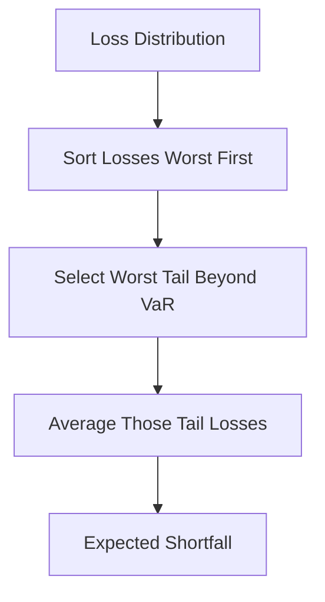

# Expected Shortfall (CVaR/TVaR)

**What it is.** Expected Shortfall is the average loss you suffer on the bad days that exceed your Value-at-Risk threshold — it measures how deep the tail goes, not just where it starts.

VaR tells you the cutoff ("you lose at most $1M 99% of the time") but is silent about the worst 1%. ES fills that gap: `ES = mean(losses worse than VaR)`. If the worst 1% of days average a $5M loss, your ES is $5M even though VaR was $1M. ES is also "coherent" — merging two portfolios never makes ES larger than the sum, which VaR can violate, so it does not punish diversification.

Why a regulator requires it: Basel III's Fundamental Review of the Trading Book replaced VaR with 97.5% ES for market-risk capital precisely because ES sees the tail and behaves sensibly under aggregation.

**When to pick this.** Regulatory capital, fat-tailed books, or any time the depth of rare losses matters.

**When NOT to pick this.** When you need a single simple, widely-understood legacy number for a non-technical board, or have too little tail data to estimate the average reliably.

**Real venue.** Basel III FRTB at all internationally active banks; CME SPAN 2.

**Recommended crate.** `rust_decimal` for exact loss aggregation; `criterion` to profile tail computation.
