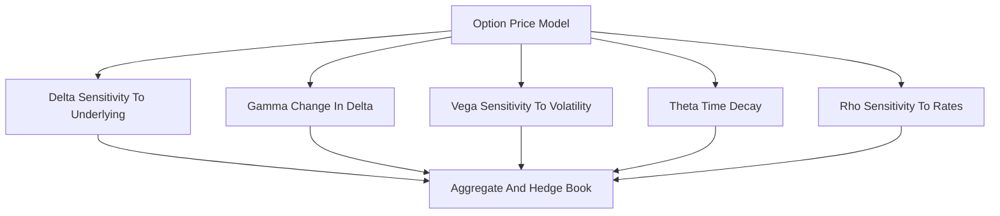

# Greeks (Delta/Gamma/Vega/Theta/Rho)

**What it is.** The Greeks are the sensitivities of an option's price to each market input, telling a desk how much it gains or loses when the underlying, volatility, time, or rates move.

Each is a partial derivative: **Delta** = price change per $1 move in the underlying; **Gamma** = how fast Delta itself moves (curvature); **Vega** = change per 1% move in volatility; **Theta** = value lost per day as expiry nears; **Rho** = change per 1% move in interest rates. A desk sums these across every option to get a net book exposure, then trades the underlying to flatten Delta and stay neutral.

Why a venue/risk team requires them: options are nonlinear, so you cannot manage them by position size alone. Greeks turn a tangle of contracts into a few exposure numbers a regulator and risk manager can monitor in real time.

**When to pick this.** Any book holding options — Greeks are the standard language for measuring and hedging nonlinear risk.

**When NOT to pick this.** Linear instruments (spot, plain futures) where Delta is trivially 1 and the others are zero; Greeks add no information.

**Real venue.** Deribit, CME, and every options market maker.

**Recommended crate.** `n/a (off-chain/math)`.
