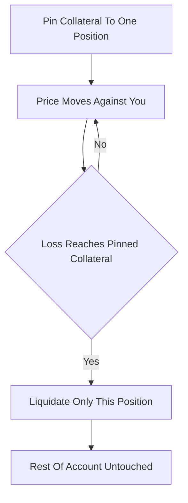

# Isolated Margin

**What it is.** Isolated margin locks a fixed amount of collateral to a single position so that if it is liquidated, only that pinned collateral can be lost — the rest of your account is safe.

You decide upfront how much money backs the trade. As the price moves against you, your loss eats into that pinned amount; when it is exhausted the venue liquidates (force-closes) just that one position. The maximum you can lose equals the collateral you assigned: `max_loss = pinned_collateral`. No other balance is touched.

Why a venue offers it: it gives users a hard, predictable blast radius. Regulators and risk teams like that one blown trade cannot cascade into the entire account.

**When to pick this.** A user wants to cap downside on a speculative or high-leverage bet and protect the rest of their balance.

**When NOT to pick this.** Hedged multi-leg strategies — isolating each leg wastes capital and can liquidate one side while the offsetting side is fine. Use cross-margin instead.

**Real venue.** Binance, Bybit, and OKX all offer Isolated Margin mode on perpetual futures.

**Recommended crate.** `rust_decimal` for exact collateral and liquidation-price math.
