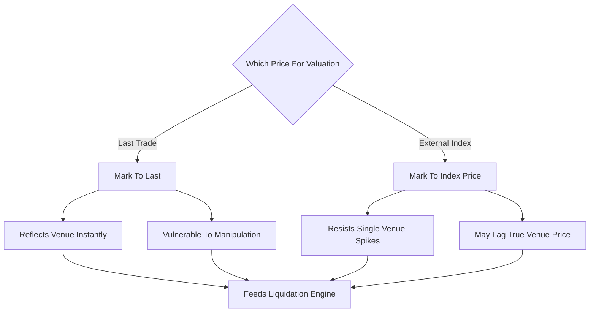

# Mark-to-Market vs Mark-to-Index

**What it is.** This is the choice of which price you use to value open positions and trigger liquidations — the venue's own last trade, or a smoothed "Mark Price" built from an external multi-exchange index.

Marking to the **last trade** is simplest and most responsive, but a single large order can briefly spike the price and trigger a cascade of liquidations — a known attack. Marking to an **index** averages the spot price across several exchanges (often plus a funding-based adjustment), so one venue's manipulated print cannot move it. The trade-off: the index can lag the venue's true price during fast genuine moves, occasionally liquidating slightly late or sparing a position that should have closed.

Why a venue requires it: perpetual-futures exchanges adopted Mark Price specifically so attackers cannot wick the order book to liquidate other traders. The robustness is worth the small lag.

**When to pick this.** Mark-to-Index for perpetual futures and any leveraged product where liquidation manipulation is a real threat.

**When NOT to pick this.** Deep, hard-to-manipulate markets, or settlement that must match the venue's own executed price exactly — use mark-to-last there.

**Real venue.** Binance, Bybit, and BitMEX all liquidate perps against a Mark Price, not last trade.

**Recommended crate.** `rust_decimal` for index and mark-price arithmetic.
