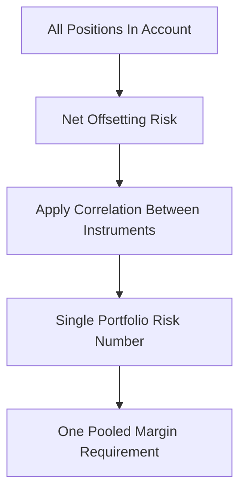

# Portfolio / Cross-Margin

**What it is.** Cross-margin pools every position in an account and charges margin on the net combined risk, giving credit when one position hedges another.

If you are long Bitcoin futures and short a correlated Ethereum future, their losses partly cancel, so the combined risk is smaller than the sum of each leg's standalone risk. Cross-margin recognizes this: it computes risk on the whole basket together rather than per position. Roughly, combined risk uses correlation `ρ`: `risk = sqrt(a² + b² + 2ρ·a·b)`, which is below `a + b` whenever positions offset.

Why a venue offers it: capital efficiency. Traders post far less collateral, which attracts volume — but the venue takes on more model risk if correlations break in a crash.

**When to pick this.** Sophisticated traders running hedged, multi-instrument books who need capital efficiency and accept shared collateral.

**When NOT to pick this.** Retail users who want one bad trade isolated; correlations that vanish in stress (the 2008/2020 problem) can wipe the whole pooled account at once.

**Real venue.** OKX and Binance "Portfolio Margin" mode; CME cross-margining between correlated futures.

**Recommended crate.** `rust_decimal` for collateral math; `dashmap` for concurrent per-account position aggregation.
