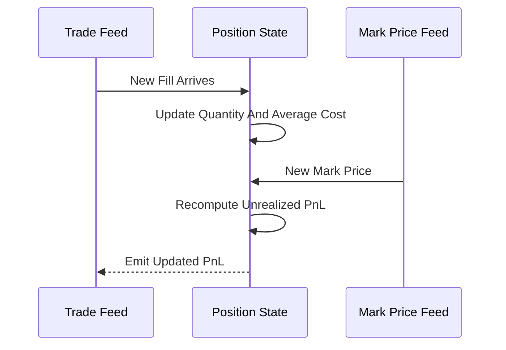

# Real-Time Incremental PnL

**What it is.** Incremental PnL updates a position's profit and loss on each individual trade or price tick by adjusting running totals, instead of re-summing the entire trade history every time.

Profit splits in two. **Realized** PnL is locked in when you reduce a position; **unrealized** is the paper gain on what you still hold: `unrealized = qty × (mark − avg_cost)`. On a new fill you update only two running numbers — the position quantity and the weighted-average cost — in O(1) time. On a new mark price you just re-evaluate the formula. Neither requires replaying thousands of past trades.

Why a venue requires it: liquidation and margin engines must know your PnL within microseconds of every tick. Recomputing from full history per tick is far too slow at exchange volumes.

**When to pick this.** High-frequency books where PnL must refresh per trade/tick with minimal latency.

**When NOT to pick this.** Complex tax-lot accounting (FIFO/LIFO matching) or end-of-day reconciliation, where a careful full recompute is correct and the speed of incremental updates is unnecessary.

**Real venue.** Every derivatives exchange's real-time risk engine (Binance, CME).

**Recommended crate.** `rust_decimal` for exact average-cost math; `dashmap` for concurrent per-account position state.
