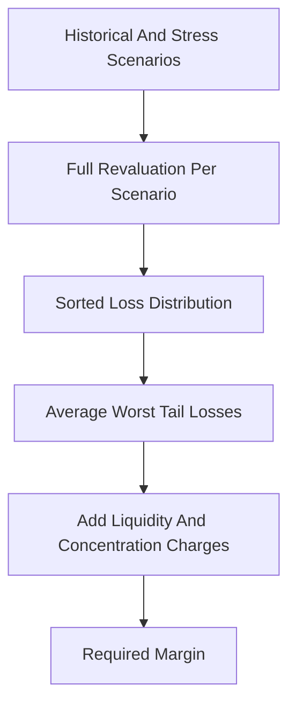

# SPAN 2 / Expected-Shortfall Margin

**What it is.** SPAN 2 is CME's modern replacement for SPAN that charges margin based on Expected Shortfall (the average loss across the worst outcomes) instead of a single worst fixed scenario.

Where old SPAN used 16 hand-set scenarios and kept only the single biggest loss, SPAN 2 runs many historical and hypothetical scenarios, sorts the resulting losses, and averages the worst tail. If you take the worst 2.5% of outcomes, the charge is `ES = mean(losses in worst 2.5%)`. It then layers on extra charges for illiquid or concentrated positions.

Why a venue moves to it: regulators (post-2008, and Basel's market-risk rules) prefer ES because it accounts for how bad the tail is, not just where it starts. SPAN's single worst case ignored everything beyond that one point.

**When to pick this.** A modern clearinghouse needing tail-sensitive, defensible margin aligned with current Basel guidance.

**When NOT to pick this.** Tiny venues without a rich scenario set or compute budget; you cannot honestly estimate a tail from a handful of scenarios.

**Real venue.** CME Group (rolling out SPAN 2 across asset classes since ~2021).

**Recommended crate.** `rust_decimal` for exact margin totals; pair with `rayon`-style parallel revaluation if scenarios grow large.
