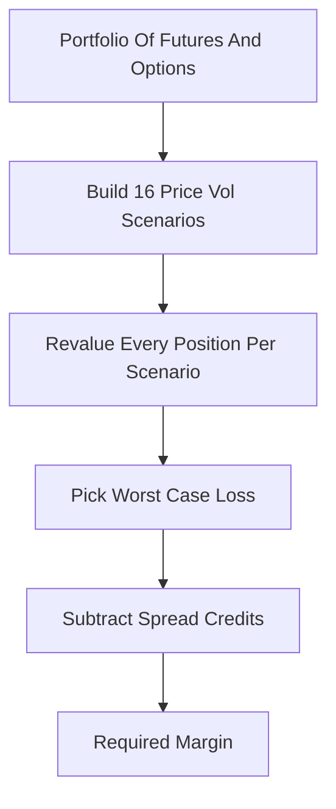

# SPAN (Standard Portfolio Analysis of Risk)

**What it is.** SPAN computes the margin (cash a trader must post as a safety deposit) by repricing the whole portfolio under a fixed grid of "what if" market moves and charging the worst loss.

The grid is small and deterministic: typically 16 scenarios mixing the price up/down by a set range (the "scan range") with volatility up/down. For each scenario it sums every position's gain or loss, then takes the single largest loss as the base risk. Offsetting positions (e.g. long one contract, short a related one) earn spread credits that reduce the charge.

Why a venue requires it: it is transparent and reproducible. Any clearinghouse member can recompute the exact same number from published risk-array files, so disputes are rare.

**When to pick this.** You clear listed futures and options and need a regulator-blessed, auditable margin that members can independently verify.

**When NOT to pick this.** Fat-tail or path-dependent portfolios where 16 fixed scenarios miss real risk; modern crypto perps where moves exceed the scan range.

**Real venue.** CME Group, ICE, and most global futures clearinghouses since 1988.

**Recommended crate.** `rust_decimal` (exact money math; floating-point rounding errors are unacceptable in posted margin).
