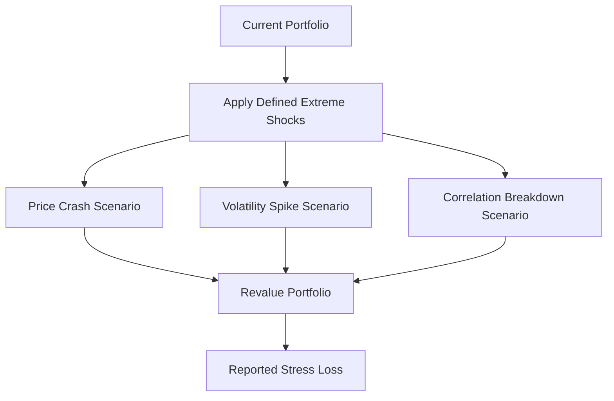

# Stress Testing

**What it is.** Stress testing revalues your portfolio under deliberately extreme, named scenarios — a 30% crash, a volatility spike, correlations snapping to 1 — to see what you would lose if the worst happened.

Unlike VaR or Expected Shortfall, which infer risk from statistical history, stress tests are scenario-driven: a human defines the shock ("repeat the 2008 crash" or "ETH drops 40% in an hour") and you simply reprice everything under it. The output is a concrete loss for a concrete catastrophe, not a probability. Reverse stress testing flips it: "what shock would wipe us out?"

Why a regulator requires it: history-based models miss events not in the sample. Post-2008, supervisors (Basel, the Fed's CCAR) mandate stress tests so a firm proves it survives shocks the statistics never saw.

**When to pick this.** You must demonstrate survival under specific catastrophes or hunt for hidden concentrations that statistical risk misses.

**When NOT to pick this.** As your only risk measure — scenarios are arbitrary and give no probability; pair with VaR/ES, do not replace them.

**Real venue.** Fed CCAR/DFAST bank stress tests; clearinghouse default-fund sizing.

**Recommended crate.** `rust_decimal` for revaluation; `rayon`-style parallelism for many scenarios.
