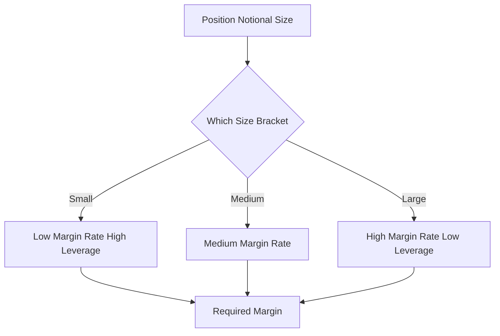

# Tiered / Bracketed Margin

**What it is.** Tiered margin raises the required margin rate (and lowers allowed leverage) as a position grows, because large positions are harder to liquidate without moving the price.

Positions fall into brackets by notional size (price times quantity). A small position might need 1% margin (100x leverage); a huge one might need 20% (5x). The venue publishes a ladder, and your margin is the rate of the bracket your size lands in: `margin = notional × rate(tier)`.

Why a venue requires it: liquidity risk. If a whale's position must be force-closed, dumping it into a thin order book causes slippage the venue must absorb. Charging more margin on big positions pre-funds that risk and discourages dangerously large bets.

**When to pick this.** A retail derivatives venue offering high leverage on small size while staying solvent if a large position must be liquidated.

**When NOT to pick this.** Institutional books where a true portfolio/risk-based model (cross-margin, SPAN) prices netting and correlation far more accurately than crude size buckets.

**Real venue.** Binance and Bybit use tiered/bracketed maintenance-margin tables on perpetual futures.

**Recommended crate.** `rust_decimal` for notional math; `slab` for compact, indexable tier tables.
