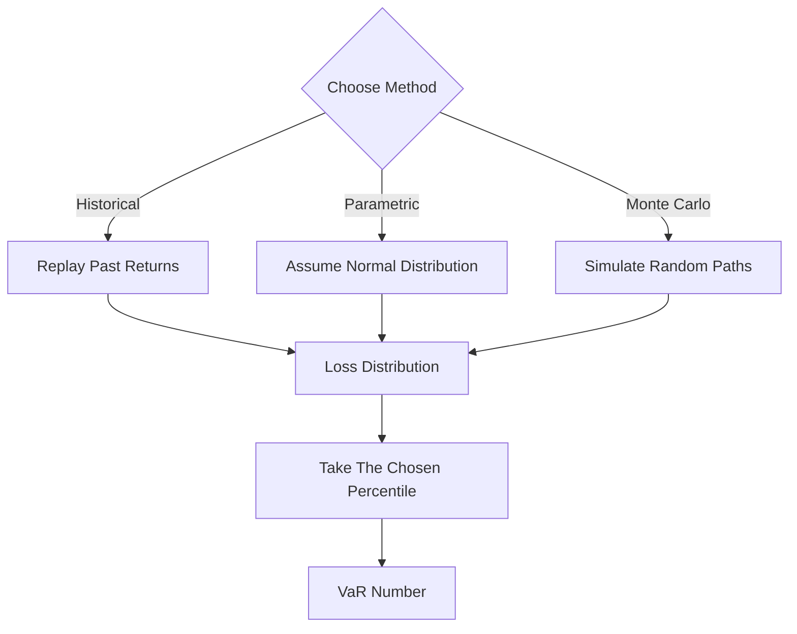

# Value at Risk (VaR)

**What it is.** Value at Risk answers "over the next day, what loss will I not exceed with 99% confidence?" — a single number summarizing downside risk.

A 1-day 99% VaR of $1M means: on 99 days out of 100 you lose less than $1M; it says nothing about the worst 1 day. Three ways to compute it: **Historical** replays actual past returns and reads off the percentile; **Parametric** assumes returns are normal and uses `VaR = z × σ × value` (z ≈ 2.33 for 99%); **Monte Carlo** simulates thousands of random future paths and reads the percentile.

Why a regulator requires it: Basel market-risk rules used VaR for decades to size the capital a bank holds against trading losses. It is one comparable number across desks.

**When to pick this.** A standard, board-friendly daily risk figure you can compute three independent ways and backtest.

**When NOT to pick this.** When the tail matters — VaR ignores how bad losses beyond the threshold get, and parametric VaR badly underestimates fat-tailed crypto. Use Expected Shortfall.

**Real venue.** Every major bank; Basel II/III capital frameworks.

**Recommended crate.** `rust_decimal` for P&L; `criterion` to benchmark Monte Carlo paths.
